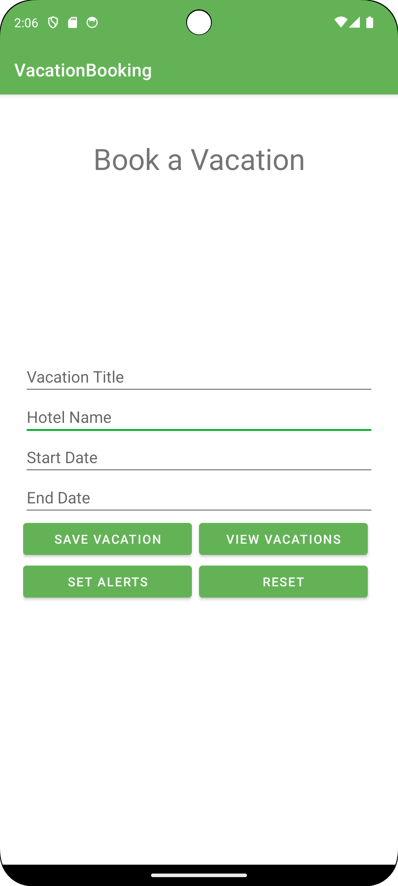

# Vacation Planner

The Vacation Planner is an Android mobile application designed to help users manage their vacations and excursions. Users can enter details about their vacations, including the title, accommodation, start date, and end date. They can also add excursions to each vacation, specifying the excursion title and date.

#### Home Page

## Features

- **Create, Update, Delete Vacations:** Users can add, edit, and remove vacations.
- **Add Excursions:** Users can add excursions to their vacations.
- **Validation:** Input validation ensures that dates are formatted correctly and that excursion dates are during the associated vacation.
- **Alerts:** Users can set alerts for vacation start and end dates as well as excursion dates.
- **Sharing:** Users can share vacation details via email, clipboard, or SMS.

## Screenshots

#### Vacations Page

#### Create Excursion

#### Excursion Page

#### Share Vacation

